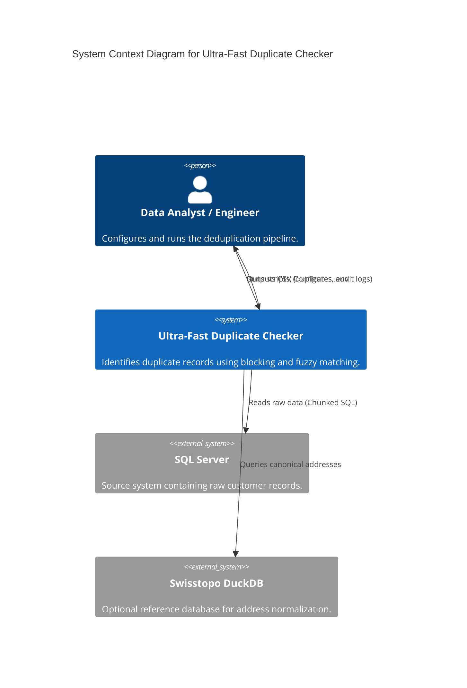

# System Architecture Document: Ultra-Fast Duplicate Checker

## 1. Executive Summary

The **Ultra-Fast Duplicate Checker** is a high-performance, modular Python application designed to identify duplicate records in large datasets (currently tested up to 7.5 million records). Unlike traditional iterative comparison methods, this system utilizes **vectorized operations** and **parallel processing** to achieve near-linear scalability, reducing processing time from days to minutes.

This document outlines the architectural design, key components, and data flow of the system. It is intended for development teams, system architects, and stakeholders to understand the system's technical foundation, ensuring efficient maintenance, scalability, and alignment with strategic business goals.

### 1.1 Strategic Alignment
*   **Scalability:** Designed to handle increasing data volumes (10M+) without exponential performance degradation.
*   **Accuracy:** Implements multi-pass blocking and specific German/Swiss business rules to maximize recall and precision.
*   **Observability:** Provides detailed audit logs and optional Swisstopo address normalization for transparent decision-making.

---

## 2. Architectural Principles

The system adheres to the following core architectural principles:

1.  **Vectorization First:** Wherever possible, operations are performed on entire columns (Pandas Series/NumPy arrays) rather than iterating through rows. This leverages low-level CPU optimizations and CPU caches.
2.  **Stateless Parallelism:** The core processing unit (a "block") is self-contained. Worker threads process blocks independently without shared mutable state, minimizing lock contention.
3.  **Two-Stage Deduplication:** The pipeline strictly separates candidate generation (Blocking) from detailed comparison (Matching).
    *   *Stage 1 (Blocking):* High-recall, low-cost keys to group potential duplicates.
    *   *Stage 2 (Matching):* High-precision, computationally expensive comparisons on small subsets.
4.  **Modularity:** Core logic is encapsulated in the `dedupe` package, separating it from data ingestion (`io.py`), configuration (`config.py`), and execution scripts (`scripts/`).

---

## 3. System Context (C4 Level 1)

The system operates as a batch processing pipeline that ingests data from a SQL Server database, optionally enriches it with external reference data (Swisstopo), and outputs results to CSV files.

---

## 4. Container View (C4 Level 2)

The system is a monolithic Python application structured as a package (`dedupe`) with a Command Line Interface (CLI).

| Container | Technology | Responsibilities |
| :--- | :--- | :--- |
| **CLI / Scripts** | Python (`scripts/`) | Entry point, argument parsing, orchestration of the pipeline. |
| **Core Application** | Python (`dedupe/`) | Domain logic, blocking, matching, scoring. |
| **Data Access Layer** | `pandas`, `sqlalchemy` | Efficient chunked reading from SQL Server. |
| **Reference Store** | `DuckDB` | Embedded OLAP database for fast address lookups (Swisstopo). |
| **File System** | OS | Storage for output CSVs and logs. |

---

## 5. Component View (C4 Level 3)

The core application (`dedupe`) is composed of the following key components:

### 5.1 Pipeline Orchestrator (`pipeline.py`)
*   **Responsibility:** Manages the end-to-end workflow.
*   **Key Functions:**
    *   `run_pipeline`: Main driver. Connects to DB, reads chunks, and initializes thread pools.
    *   `process_block`: Worker function executed by threads. Orchestrates matching within a single block.
*   **Concurrency:** Uses `ThreadPoolExecutor` to process multiple blocks simultaneously.

### 5.2 Preprocessor (`preprocess.py` & `swisstopo.py`)
*   **Responsibility:** Cleans and normalizes data before blocking.
*   **Logic:**
    *   Handles German umlauts (explicit `ue`, `oe`, `ae` conversion).
    *   Integrates `SwisstopoAddressNormalizer` to map input addresses to canonical PLZ/Street/House keys.
    *   Generates `street_full` and `street_sig_full` for multilingual-safe matching.

### 5.3 Blocker (`blocking.py`)
*   **Responsibility:** Generates blocking keys to group similar records.
*   **Strategies:**
    *   **Address-Based (Default):**
        *   *Pass A:* `plz` | `addr_key_building` (Strict building match)
        *   *Pass B:* `plz` | `addr_key_typo` (Typo recovery)
    *   **Name-Based (Legacy):**
        *   *Pass A:* `last` | `first` | `plz` | `year`
        *   *Pass B:* Swap-invariant signature (min/max of names).
*   **Oversized Block Handling:** recursively splits large blocks using sub-keys (Name Prefix -> Stable Hash) to prevent memory blowouts.

### 5.4 Candidate Generator (`candidates.py`)
*   **Responsibility:** efficiently pairs records within a block.
*   **Methods:**
    *   `iter_exact_pairs`: Hash-based lookup for identical records (swap-invariant).
    *   `iter_windowed_fuzzy_pairs`: Sorted Neighborhood Method (sliding window) for large blocks to avoid $O(N^2)$ complexity.
    *   `iter_fuzzy_pairs`: `rapidfuzz.process.extract` for smaller blocks.

### 5.5 Scorer (`scoring.py`)
*   **Responsibility:** Calculates similarity scores for candidate pairs.
*   **Logic:**
    *   Computes Levenshtein/Jaro-Winkler distance on names.
    *   Applies business rules (e.g., penalty for different birth dates).
    *   Returns a `MatchResult` with confidence score and match type (e.g., `fuzzy_swapped`).

---

## 6. Data Flow

1.  **Ingestion:**
    *   `run_pipeline` initiates a connection to SQL Server.
    *   Data is read in chunks (default 200k rows) using `read_sql_df`.
2.  **Normalization:**
    *   Each chunk is passed to `preprocess`.
    *   (Optional) `SwisstopoAddressNormalizer` queries DuckDB to enrich address data.
3.  **Blocking:**
    *   `iter_blocks` computes blocking keys (e.g., PLZ+Street).
    *   Data is sorted by these keys to form contiguous "blocks".
    *   Large blocks are recursively split.
4.  **Parallel Matching:**
    *   Blocks are submitted to the `ThreadPoolExecutor`.
    *   **Stage 1:** Exact duplicates are found and marked.
    *   **Stage 2:** Fuzzy candidates are generated (Windowed or All-Pairs).
    *   Pairs are scored; those exceeding the threshold (default 0.80) are retained.
5.  **Output:**
    *   Results are collected and written immediately to the output CSV to minimize memory usage.
    *   (Optional) Audit logs are written to a separate CSV.

---

## 7. Deployment & Infrastructure

*   **Runtime Environment:**
    *   Python 3.8+
    *   **Dependencies:** `pandas`, `numpy`, `rapidfuzz`, `duckdb`, `tqdm`, `pyodbc`.
*   **Infrastructure Requirements:**
    *   **CPU:** Multi-core processor (pipeline scales linearly with cores).
    *   **Memory:** 16GB+ RAM recommended for datasets >1M rows (Pandas is memory-intensive).
    *   **Storage:** Fast SSD recommended for DuckDB lookups and temp file usage.
*   **Configuration:**
    *   Environment variables (`.env`) manage DB credentials (`DEDUPE_DB_*`).
    *   Runtime arguments control blocking modes and thresholds.

---

## 8. Cross-Cutting Concerns

### 8.1 Error Handling
*   Database connection failures are caught early in `run_pipeline`.
*   Individual block failures (rare) are isolated by the `ThreadPoolExecutor`, preventing full pipeline crash (though currently exceptions propagate to ensure data integrity).

### 8.2 Logging & Observability
*   **Console:** `tqdm` progress bars provide real-time status (chunks/blocks processed).
*   **Audit Logs:** `normalization_audit.csv` captures how addresses were transformed/matched against Swisstopo.
*   **File Logs:** Logs are rotated in `logs/` directory.

### 8.3 Security
*   **Credentials:** Database passwords are read from environment variables or prompted at runtime; never stored in code.
*   **Data Handling:** Data is processed in-memory and written to local disk; no external API calls are made.

---

## 9. Risks and Technical Debt

| Risk / Debt | Description | Mitigation Strategy |
| :--- | :--- | :--- |
| **Memory Consumption** | Pandas loads full chunks into memory. Extremely large chunks or leaks could cause OOM. | Configurable `chunksize`; Recursive block splitting. |
| **Legacy Code** | `legacy/` directory contains deprecated Splink code and old scripts. | Explicitly separate legacy code; exclude from new development paths. |
| **SQL Server Dependency** | Hard dependency on `pyodbc` and SQL Server. | Future refactor to use `sqlalchemy` more generically could support Postgres/MySQL. |
| **Boundary Effect** | Chunked processing means duplicates spanning chunk boundaries (e.g., row 199,999 and 200,000) might be missed if using row-based chunks. | **Critical:** Current implementation processes chunks independently. *Planned Improvement:* Implement overlap or global blocking pass. |
